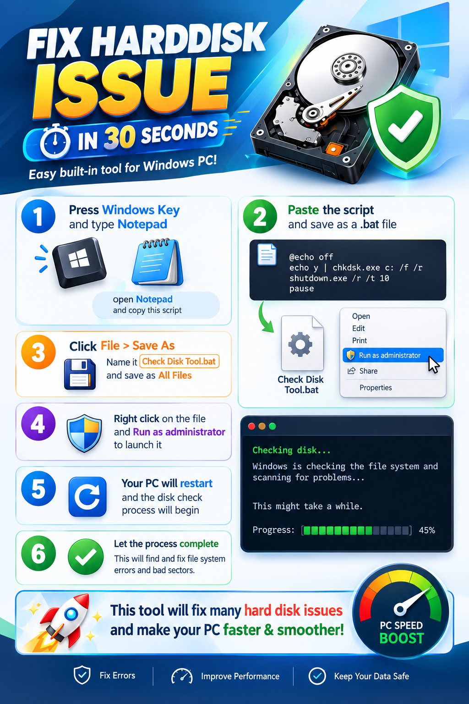

    

## Jenis Penyimpanan

Komputer umumnya menggunakan salah satu atau kedua jenis penyimpanan berikut:

| Jenis | Cara kerja | Karakteristik |
| --- | --- | --- |
| HDD (Hard Disk Drive) | Menyimpan data pada piringan yang berputar. | Biasanya menawarkan kapasitas besar dengan biaya lebih rendah. Memiliki komponen bergerak sehingga lebih sensitif terhadap benturan. |
| SSD (Solid State Drive) | Menyimpan data pada chip memori tanpa komponen bergerak. | Umumnya lebih cepat, senyap, dan tahan terhadap guncangan ringan. Harga per kapasitas biasanya lebih tinggi daripada HDD. |

> Istilah “hard disk” sering dipakai untuk menyebut semua media penyimpanan komputer, termasuk SSD. HDD/SSD berbeda dari RAM: file tetap tersimpan di HDD/SSD saat komputer dimatikan, sedangkan isi RAM bersifat sementara.

## Memeriksa Ruang Penyimpanan di Windows

1. Buka **File Explorer**.
2. Pilih **This PC** atau **Komputer Ini** pada panel sebelah kiri.
3. Lihat bagian **Devices and drives** untuk mengetahui kapasitas dan ruang yang masih tersedia pada setiap drive.
4. Jika ruang hampir habis, tinjau file pribadi yang tidak diperlukan dan kosongkan **Recycle Bin** setelah memastikan isinya memang tidak dibutuhkan.

Jangan menghapus folder Windows, Program Files, folder aplikasi sekolah, atau file yang tidak dikenal untuk mencoba menambah ruang. Hubungi tim IT jika tidak yakin file mana yang aman dihapus. File yang disimpan pada server atau layanan cloud juga dapat memiliki aturan kapasitas dan pencadangan yang berbeda.

## Gejala Masalah Penyimpanan

Perhatikan tanda-tanda berikut:

- Muncul pesan bahwa ruang disk hampir habis atau file tidak dapat disimpan.
- Komputer sering berhenti merespons, lambat membuka file, atau mengalami kesalahan saat menyalakan Windows.
- File atau folder tidak dapat dibuka, berubah nama, atau hilang tanpa disengaja.
- Drive tidak terlihat di File Explorer atau muncul pesan bahwa drive perlu diformat.
- HDD mengeluarkan bunyi klik atau gesekan yang tidak biasa.

Satu gejala saja belum tentu berarti drive rusak. Misalnya, komputer yang lambat dapat disebabkan oleh banyak hal selain penyimpanan. Namun, bunyi tidak biasa, file yang menghilang, atau permintaan untuk memformat drive perlu segera dilaporkan.

## Langkah Awal yang Aman

1. **Simpan pekerjaan dan hentikan aktivitas yang tidak penting.** Jika muncul pesan kesalahan atau file mulai menghilang, jangan terus mencoba membuka atau menyalin banyak file.
2. **Jangan matikan atau cabut drive secara paksa** saat komputer sedang menyalin, menyimpan, atau memperbarui file.
3. **Cadangkan file penting ke lokasi yang disetujui sekolah** hanya jika drive masih dapat diakses dengan normal dan prosesnya tidak menimbulkan bunyi atau kesalahan baru. Jangan menjadikan satu-satunya salinan pada drive yang diduga bermasalah.
4. **Catat pesan kesalahan dengan tepat.** Foto layar atau salin teksnya, serta catat kapan masalah mulai terjadi dan tindakan terakhir yang dilakukan.
5. **Hubungi tim IT sekolah** untuk pemeriksaan lebih lanjut. Sampaikan nama/perangkat yang digunakan, drive yang bermasalah, gejala, dan apakah ada data penting yang belum dicadangkan.

Jangan membuka casing HDD/SSD, memasang aplikasi perbaikan dari situs yang tidak dikenal, atau menjalankan skrip yang meminta akses administrator. Tindakan tersebut dapat menyebabkan kehilangan data, merusak perangkat, atau mengubah konfigurasi komputer.

## Memahami Langkah pada Infografik

Infografik menunjukkan penggunaan alat pemeriksaan disk bawaan Windows, **CHKDSK**, melalui file batch (`.bat`). Berikut arti langkah-langkah yang ditampilkan:

1. **Membuka Notepad**: Notepad digunakan untuk menulis atau menempelkan teks skrip.
2. **Menempelkan skrip**: skrip pada gambar menjalankan `chkdsk.exe` untuk drive `C:` dengan opsi `/f` dan `/r`, kemudian memanggil perintah restart Windows.
3. **Menyimpan sebagai file `.bat`**: ekstensi `.bat` membuat Windows memperlakukan file tersebut sebagai kumpulan perintah yang dapat dijalankan. Memilih **All Files** saat menyimpan membantu mencegah Notepad menambahkan ekstensi `.txt`.
4. **Memilih “Run as administrator”**: pemeriksaan dan perbaikan drive sistem membutuhkan izin administrator. Jangan memberikan izin ini kepada skrip yang tidak berasal dari atau belum disetujui tim IT.
5. **Komputer dimulai ulang**: perintah pada gambar meminta Windows melakukan restart dengan penghitung waktu 10 detik. Simpan pekerjaan dan tutup aplikasi terlebih dahulu; jangan mengandalkan peringatan untuk menyimpan pekerjaan.
6. **Menunggu pemeriksaan selesai**: pemeriksaan dapat berlangsung jauh lebih lama dari 30 detik, bergantung pada kapasitas, kondisi, dan jumlah data pada drive. Jangan mematikan komputer selama pemeriksaan berjalan.

### Apa yang Dilakukan CHKDSK?

- Opsi **`/f`** meminta Windows memperbaiki kesalahan pada sistem file.
- Opsi **`/r`** mencari bagian disk yang tidak dapat dibaca dan mencoba menyelamatkan informasi yang masih dapat dibaca. Opsi ini juga mencakup fungsi `/f` dan dapat memakan waktu lama.
- Karena perintah pada gambar menyebut **`C:`**, pemeriksaan tersebut ditujukan ke drive `C:` saja, bukan otomatis ke semua drive.

CHKDSK memeriksa sistem file dan keterbacaan sektor; CHKDSK **tidak memperbaiki kerusakan fisik HDD/SSD**, tidak menjamin semua file dapat dipulihkan, dan tidak otomatis membuat komputer lebih cepat. Waktu “30 detik”, klaim memperbaiki banyak masalah, serta klaim “menjaga data tetap aman” pada infografik bukan jaminan hasil.